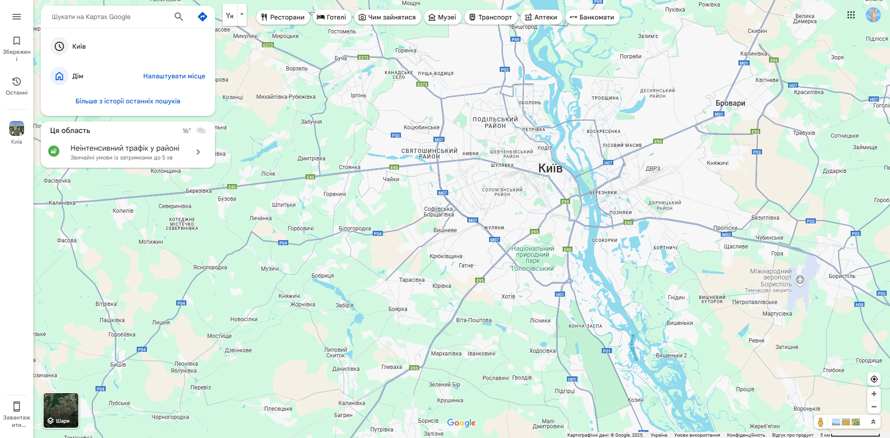

# My Project Start 🚀

Це сучасний React-проєкт з підтримкою SCSS, адаптивним дизайном, темною/світлою темою, слайдерами, попапами, формами та футером із соціальними іконками.

## 📸 Скриншот



## ⚙️ Стек технологій

- React
- SCSS (Sass)
- Vite
- LocalStorage (для збереження теми)
- Адаптивна верстка (Mobile First)
- FontAwesome для іконок

## 🔧 Функціонал

- 🌙 Темна/світла тема
- 🧾 Динамічні секції: "Про нас", "Слайдер", "Послуги", "Карта", "Форма замовлення"
- 📞 Кнопка замовлення зворотного дзвінка з формою (ім’я, телефон, коментар)
- 📱 Адаптивність до мобільних пристроїв
- 👣 Footer із соціальними іконками з ефектами
- 🧩 Модульна структура компонентів

## 🖥 Як запустити

```bash
git clone  https://vv17-02b.github.io/my-projektStart/
cd my-projektStart
npm install
npm run dev
